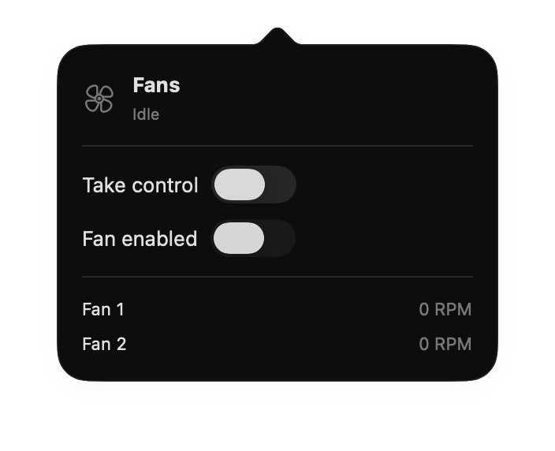
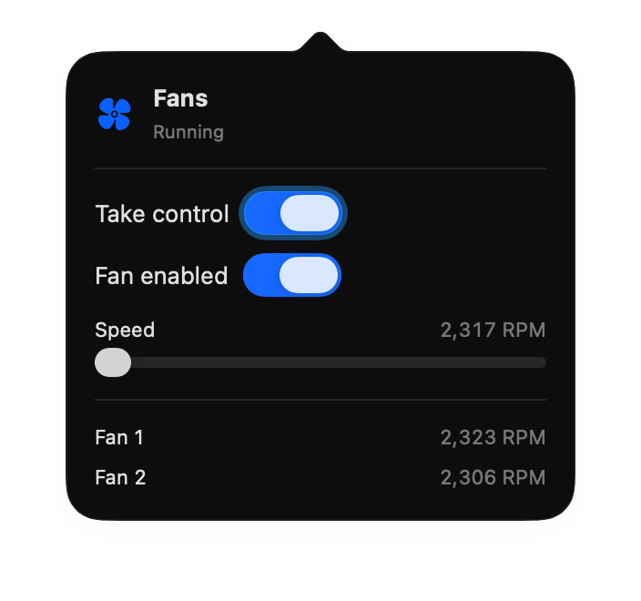

  

<h1 align="center">MyCooler</h1>

  A status-bar-only macOS app for watching and steering your Mac's fans
  on Apple Silicon. 
  Built with SwiftUI and talks to <code>AppleSMC</code> directly — no
  privileged helper, no kext.

| Idle | Running |
| --- | --- |
|  |  |
| Default state — macOS owns the fans, both toggles off, the slider is hidden, and the header icon is the outline fan. The per-fan list still reports live actual RPM (here, `0` because the fans are stopped). | After flipping *Take control* and *Fan enabled*, the speed slider appears, bounded by the tightest envelope of every fan's reported min/max. The header icon flips to the filled, blue fan. |

## Why this exists

MyCooler is **open source, free, and built for personal use** — and I'm
happy to share it with anyone else who needs the same thing. No sign-up,
no subscription, no in-app purchase, no trial timer. The source is right
here; if you don't trust it, read it.

There are obvious moments when you want the fans louder than macOS
thinks they should be — gaming is the headline case. Even a short
session warms the chassis enough that the WASD area gets uncomfortable
to rest fingers on, and macOS's thermal policy waits a beat too long
before it ramps the fans, so the heat builds up under your palms before
relief arrives. The same applies to long Xcode compiles, local LLM
inference (Ollama, Stable Diffusion), and 4K exports in Final Cut /
DaVinci.

Heat matters longer-term, too. Sustained high temperatures accelerate
lithium-ion battery wear — Apple's own guidance is to keep the device
under 35 °C ambient — and the SoC throttles once it crosses its
junction limit, dropping frames and slowing builds. Pre-spinning the
fans a little earlier trades a tiny bit of noise for cooler hands,
slower battery degradation over the years, and steadier performance
under load. The reverse is supported too: force the fans to **0 RPM**
for a silent Zoom call or screen recording, then hand control back when
you're done.

I'm a software engineer, but Mac and Swift aren't my day job. If
something looks unidiomatic, the UI could use polish, or you spot a
better approach anywhere in the code, pull requests are very welcome —
see [Contributing](#contributing).

## What it does

MyCooler lives in the menu bar — no dock icon, no main window. The
status item shows the current fan RPM next to a small fan icon that
fills in when at least one fan is spinning. Clicking it opens a
compact popover with:

- **Take control** — flips the fans out of system-managed mode so you
  can set the speed yourself. Off by default; flipping it off again
  hands control back to macOS.
- **Fan enabled** — once you've taken control, this lets you force
  the fans to **0 RPM** (silent) or any speed in the supported range.
  When you're not in control, the toggle mirrors whatever the hardware
  is actually doing so it never lies.
- **Speed slider** — bounded by the fans' reported min/max. When more
  than one fan is present they share a single slider; the bounds are
  the tightest envelope that's safe for every fan.
- **Per-fan readout** — live actual RPM for each fan below the slider.

Right-click the status item for **Quit**.

## How it works

Everything goes through the user-space `AppleSMC` IOKit service. There
is **no privileged helper, no kext, no signed installer** — just an
`io_connect_t` opened with `IOServiceOpen` and `SMCParamStruct`
payloads sent via `IOConnectCallStructMethod` selector 2
(`kSMCHandleYPCEvent`).

Polled keys (every second):

- `FNum` — number of fans (`ui8`).
- `F{N}Ac` — actual RPM (`flt`).
- `F{N}Mn` / `F{N}Mx` — reported min / max RPM, read only while
  macOS is in charge so we don't pin them to whatever value we just
  wrote.

The Apple Silicon **Ftst unlock sequence** runs when you flip *Take
control* on:

1. Write `Ftst = 1` to put the SMC into diagnostic mode so
   `thermalmonitord` lets go.
2. Poll each `F{N}Md` until it transitions out of `3` (system mode),
   with a 10-second deadline.
3. For each fan, write `F{N}Md = 1` (manual) with up to six seconds
   of retry — the daemon needs a moment to release the key — then
   immediately write `F{N}Tg` to pin the target. The pin happens
   straight after the mode flip so the SMC doesn't briefly ramp to
   its default RPM in the gap.
4. Publish the initial state to the UI: if the fans were already
   spinning we adopt their average RPM as the target, otherwise we
   start at 0.

Releasing control writes `F{N}Md = 0` where the SMC accepts it, then
`Ftst = 0` to hand thermal management back to `thermalmonitord`.
Some Macs reject the `F{N}Md = 0` write while still in manual mode;
that's fine, because clearing `Ftst` puts the SMC back into system
mode and `F{N}Md` reverts on its own.

## Caveats

- **Apple Silicon only.** Intel Macs use a different SMC key set and
  are out of scope. The app has been developed and tested on an M3
  Pro; M1, M2, and M4 share the same key conventions and are
  expected to work — if you try one of those, an issue confirming or
  denying that is appreciated.
- **Not sandboxed by design.** `IOServiceOpen` against `AppleSMC`
  doesn't work from inside an App Sandbox container on macOS 26, so
  the entitlement is off. Don't ship this on the Mac App Store.
- **The SMC can still override you.** Diagnostic mode is honoured for
  RPM writes, but the firmware retains the right to ramp the fans up
  if it decides it needs more airflow. MyCooler doesn't fight this;
  it just reports the actual RPM.
- **One process at a time owns SMC.** Running MyCooler alongside
  another fan controller (Macs Fan Control, smcFanControl, TG Pro,
  etc.) will produce fights over `F{N}Md`. Quit one before using the
  other.

## Install

Requires **macOS 26 or later** and an Apple Silicon Mac.

1. Download the latest `.dmg` from the [Releases page](https://github.com/KudAndrii/MyCooler/releases/latest).
2. Open the DMG and drag **MyCooler.app** into `/Applications`.
3. First launch: right-click → **Open**. The build isn't notarised, so
   Gatekeeper warns once; after that it opens normally.

## Build from source

For contributors, or if you want to tweak the code. Requires **Xcode 26
or later** in addition to the macOS requirement above.

1. Open `my-cooler.xcodeproj`.
2. Select the **my-cooler** target → **Signing & Capabilities** and
   pick a team. "Sign to Run Locally" is fine for local-only use
   without a paid Apple Developer account.
3. **App Sandbox must stay disabled** (the capability is already
   removed). SMC access via `IOServiceOpen` doesn't work from inside
   a sandbox container on macOS 26.
4. **Run** (⌘R) — the status item appears in the menu bar.

To install a locally-built copy: switch the scheme's Run configuration
to **Release**, build (⌘B), then **Product → Show Build Folder in
Finder** and drag `MyCooler.app` from `Build/Products/Release/` to
`/Applications`.

## Contributing

Contributions are welcome. Open an issue first if you want to discuss
a larger change; for small fixes a pull request is fine.

A few notes if you're sending changes:

- Match the existing SwiftUI style (4-space indent, `@Observable` for
  view-state types, prefer `async/await` over Combine).
- `SMC` calls are synchronous and not thread-safe — the IOKit
  connection is a single resource. Keep all SMC reads and writes on
  the main actor (where the poll task and user-initiated writes
  already live). If SMC work ever becomes a perf problem, wrap it in
  an `actor` rather than spraying locks.
- If you add a new SMC key, document its type (`flt`, `fpe2`, `ui8`)
  and whether it's read-only or writable. The cheat-sheet in
  `CLAUDE.md` is the precedent.
- Don't re-enable App Sandbox; the app can't talk to `AppleSMC`
  with it on.

## License

MIT.
